

## 多通道目标语音提取实验

#### 1.模拟数据集生成参数设置如下：

| 声源数据集 | 噪声数据集  |   混合语音信噪比/dB   |声源信号能量比/dB |麦克风数目|麦克风形状|麦克风半径/m|模型房间参数/m|
| :-----:     | :------:       | :-----:             |:-----:|:----:|:-----:|:----------:|:----:|
|   Librispeech  |   WHAM | 5~15                  |-5~5|            4|环形   |0.03231|[3,5,5]~[4.5,12,12]|

#### 2.测试集实验结果
<!--  -->
###### 1.重叠类型-full(重叠率100%)

  

    
  

  

    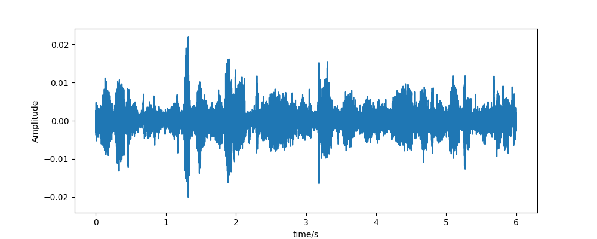
     
    
混合语音波形 

    <audio controls>
      <source src="expresults/noncausal_TSE_FFCLSTM_4ch_2chplus_noattention/full/mix.wav" type="audio/mpeg">
    </audio>
  

  

    
     
    
理想提取语音(speaker1) 

    <audio controls>
      <source src="expresults/noncausal_TSE_FFCLSTM_4ch_2chplus_noattention/full/s1.wav" type="audio/mpeg">
    </audio>
  

  

    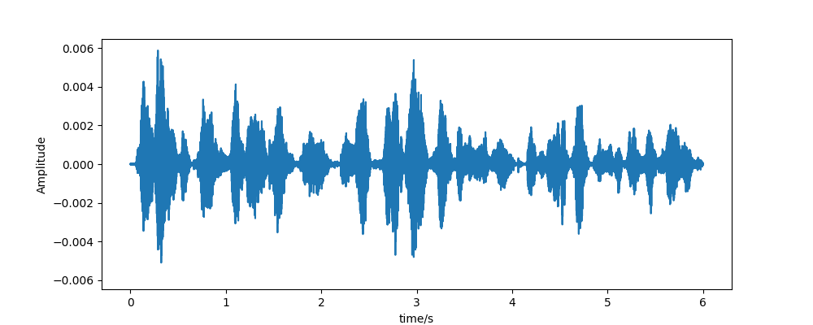
     
    
理想提取语音(speaker2) 

    <audio controls>
      <source src="expresults/noncausal_TSE_FFCLSTM_4ch_2chplus_noattention/full/s2.wav" type="audio/mpeg">
    </audio>
  

  

    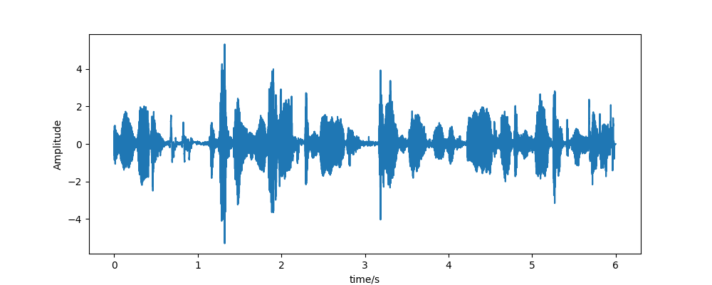
     
    
算法提取语音(speaker1) 

    <audio controls>
      <source src="expresults/noncausal_TSE_FFCLSTM_4ch_2chplus_noattention/full/est_s1.wav" type="audio/mpeg">
    </audio>
  

  

    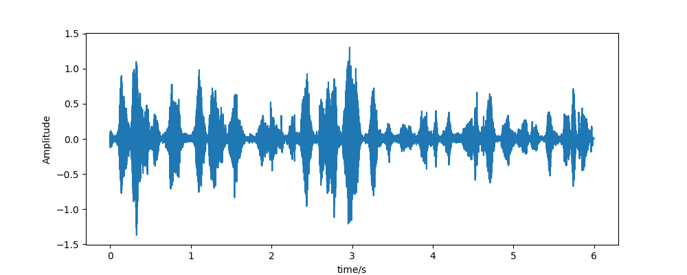
     
    
算法提取语音(speaker2) 

    <audio controls>
      <source src="expresults/noncausal_TSE_FFCLSTM_4ch_2chplus_noattention/full/est_s2.wav" type="audio/mpeg">
    </audio>
  

###### 2.重叠类型-front(重叠率30%)

  

    
  

  

    
     
    
混合语音波形 

    <audio controls>
      <source src="expresults/noncausal_TSE_FFCLSTM_4ch_2chplus_noattention/front/mix.wav" type="audio/mpeg">
    </audio>
  

  

    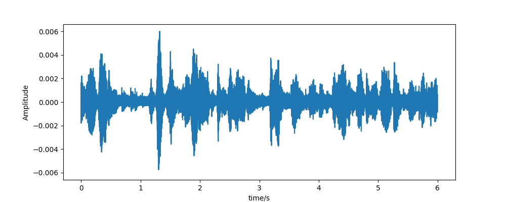
     
    
理想提取语音(speaker1) 

    <audio controls>
      <source src="expresults/noncausal_TSE_FFCLSTM_4ch_2chplus_noattention/front/s1.wav" type="audio/mpeg">
    </audio>
  

  

    
     
    
理想提取语音(speaker2) 

    <audio controls>
      <source src="expresults/noncausal_TSE_FFCLSTM_4ch_2chplus_noattention/front/s2.wav" type="audio/mpeg">
    </audio>
  

  

    
     
    
算法提取语音(speaker1) 

    <audio controls>
      <source src="expresults/noncausal_TSE_FFCLSTM_4ch_2chplus_noattention/front/est_s1.wav" type="audio/mpeg">
    </audio>
  

  

    
     
    
算法提取语音(speaker2) 

    <audio controls>
      <source src="expresults/noncausal_TSE_FFCLSTM_4ch_2chplus_noattention/front/est_s2.wav" type="audio/mpeg">
    </audio>
  

###### 3.重叠类型-mid(重叠率30%)

  

    
  

  

    
     
    
混合语音波形 

    <audio controls>
      <source src="expresults/noncausal_TSE_FFCLSTM_4ch_2chplus_noattention/mid/mix.wav" type="audio/mpeg">
    </audio>
  

  

    
     
    
理想提取语音(speaker1) 

    <audio controls>
      <source src="expresults/noncausal_TSE_FFCLSTM_4ch_2chplus_noattention/mid/s1.wav" type="audio/mpeg">
    </audio>
  

  

    
     
    
理想提取语音(speaker2) 

    <audio controls>
      <source src="expresults/noncausal_TSE_FFCLSTM_4ch_2chplus_noattention/mid/s2.wav" type="audio/mpeg">
    </audio>
  

  

    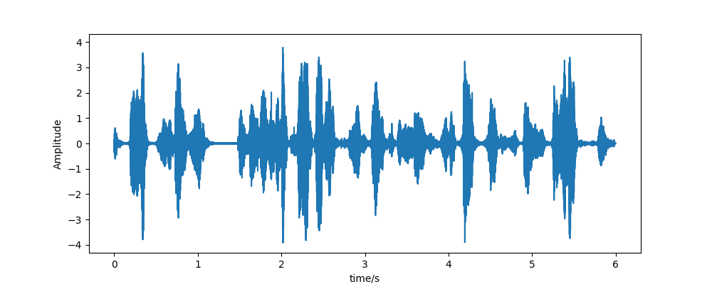
     
    
算法提取语音(speaker1) 

    <audio controls>
      <source src="expresults/noncausal_TSE_FFCLSTM_4ch_2chplus_noattention/mid/est_s1.wav" type="audio/mpeg">
    </audio>
  

  

    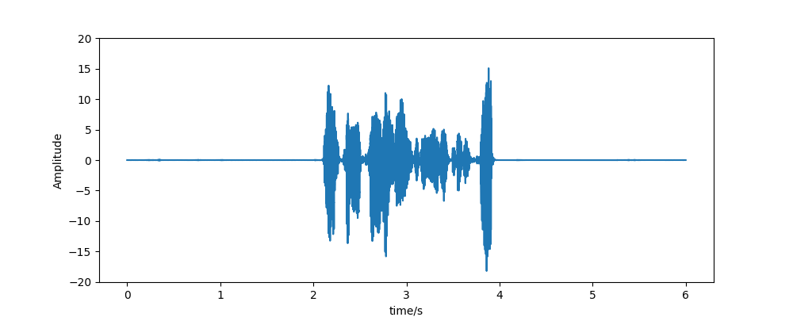
     
    
算法提取语音(speaker2) 

    <audio controls>
      <source src="expresults/noncausal_TSE_FFCLSTM_4ch_2chplus_noattention/mid/est_s2.wav" type="audio/mpeg">
    </audio>
  

###### 4.重叠类型-end(重叠率30%)

  

    
  

  

    
     
    
混合语音波形 

    <audio controls>
      <source src="expresults/noncausal_TSE_FFCLSTM_4ch_2chplus_noattention/end/mix.wav" type="audio/mpeg">
    </audio>
  

  

    
     
    
理想提取语音(speaker1) 

    <audio controls>
      <source src="expresults/noncausal_TSE_FFCLSTM_4ch_2chplus_noattention/end/s1.wav" type="audio/mpeg">
    </audio>
  

  

    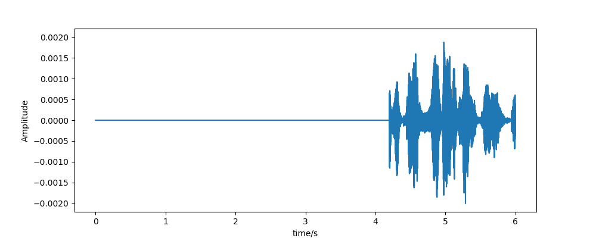
     
    
理想提取语音(speaker2) 

    <audio controls>
      <source src="expresults/noncausal_TSE_FFCLSTM_4ch_2chplus_noattention/end/s2.wav" type="audio/mpeg">
    </audio>
  

  

    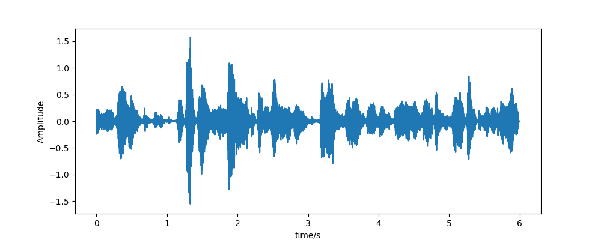
     
    
算法提取语音(speaker1) 

    <audio controls>
      <source src="expresults/noncausal_TSE_FFCLSTM_4ch_2chplus_noattention/end/est_s1.wav" type="audio/mpeg">
    </audio>
  

  

    
     
    
算法提取语音(speaker2) 

    <audio controls>
      <source src="expresults/noncausal_TSE_FFCLSTM_4ch_2chplus_noattention/end/est_s2.wav" type="audio/mpeg">
    </audio>
  

###### 5.重叠类型-headtail(重叠率30%)

  

    
  

  

    
     
    
混合语音波形 

    <audio controls>
      <source src="expresults/noncausal_TSE_FFCLSTM_4ch_2chplus_noattention/headtail/mix.wav" type="audio/mpeg">
    </audio>
  

  

    
     
    
理想提取语音(speaker1) 

    <audio controls>
      <source src="expresults/noncausal_TSE_FFCLSTM_4ch_2chplus_noattention/headtail/s1.wav" type="audio/mpeg">
    </audio>
  

  

    
     
    
理想提取语音(speaker2) 

    <audio controls>
      <source src="expresults/noncausal_TSE_FFCLSTM_4ch_2chplus_noattention/headtail/s2.wav" type="audio/mpeg">
    </audio>
  

  

    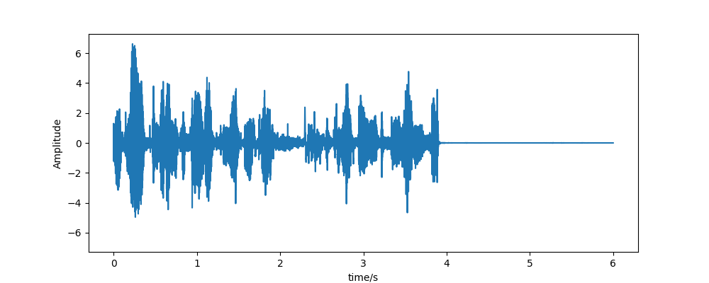
     
    
算法提取语音(speaker1) 

    <audio controls>
      <source src="expresults/noncausal_TSE_FFCLSTM_4ch_2chplus_noattention/headtail/est_s1.wav" type="audio/mpeg">
    </audio>
  

  

    
     
    
算法提取语音(speaker2) 

    <audio controls>
      <source src="expresults/noncausal_TSE_FFCLSTM_4ch_2chplus_noattention/headtail/est_s2.wav" type="audio/mpeg">
    </audio>
  

###### 6.重叠类型-sp(重叠率0%)

  

    
  

  

    
     
    
混合语音波形 

    <audio controls>
      <source src="expresults/noncausal_TSE_FFCLSTM_4ch_2chplus_noattention/sp/mix.wav" type="audio/mpeg">
    </audio>
  

  

    
     
    
理想提取语音(speaker1) 

    <audio controls>
      <source src="expresults/noncausal_TSE_FFCLSTM_4ch_2chplus_noattention/sp/s1.wav" type="audio/mpeg">
    </audio>
  

  

    
     
    
理想提取语音(speaker2) 

    <audio controls>
      <source src="expresults/noncausal_TSE_FFCLSTM_4ch_2chplus_noattention/sp/s2.wav" type="audio/mpeg">
    </audio>
  

  

    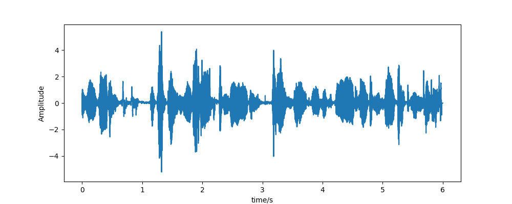
     
    
算法提取语音(speaker1) 

    <audio controls>
      <source src="expresults/noncausal_TSE_FFCLSTM_4ch_2chplus_noattention/sp/est_s1.wav" type="audio/mpeg">
    </audio>
  

  

    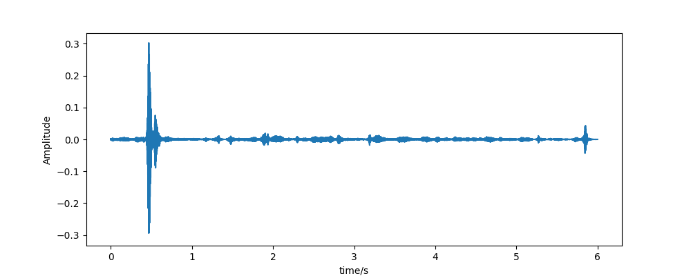
     
    
算法提取语音(speaker2) 

    <audio controls>
      <source src="expresults/noncausal_TSE_FFCLSTM_4ch_2chplus_noattention/sp/est_s2.wav" type="audio/mpeg">
    </audio>
  

<!-- # 1.双通道目标语音提取实验
## 1.实时目标语音提取
## 2.离线目标语音提取

# 四通道目标语音提取实验
## 1.实时目标语音提取
## 2.离线目标语音提取

# 单通道目标语音提取
## 1.TDspeakerbeam
## 2.spex+

## 如何处理混合语音中不存在目标说话人的情况？
1.方案1：多目标loss训练 输出估计vad 
混合语音中不存在目标说话人时vad输出为0 将vadloss 作为sisdrloss
$sisdr = \{\}$ -->

#### 3.实录数据实验结果
###### 1.不同性别说话人混合语音提取实验
录制环境：教室 
录制设备：[ReSpeaker USB Mic Array](https://wiki.seeedstudio.com/ReSpeaker-USB-Mic-Array)

  

    
    <audio controls>
      <source src="expresults/sample1_chenxu_0180_mix/mix.wav" type="audio/mpeg">
    </audio>
  

  

    
    <audio controls>
      <source src="expresults/sample1_chenxu_0180_mix/tse_chen_fullaudio_True.wav" type="audio/mpeg">
    </audio>
  

  

    
    <audio controls>
      <source src="expresults/sample1_chenxu_0180_mix/tse_xlx_fullaudio_True.wav" type="audio/mpeg">
    </audio>
  

###### 2.同性别说话人混合语音提取实验
录制环境：会议室 
录制设备：[ReSpeaker USB Mic Array](https://wiki.seeedstudio.com/ReSpeaker-USB-Mic-Array)

  

    
    <audio controls>
      <source src="expresults/sample3_chensun_090_mix/mix.wav" type="audio/mpeg">
    </audio>
  

  

    
    <audio controls>
      <source src="expresults/sample3_chensun_090_mix/tse_chen_fullaudio_True.wav" type="audio/mpeg">
    </audio>
  

  

    
    <audio controls>
      <source src="expresults/sample3_chensun_090_mix/tse_ssy_fullaudio_True.wav" type="audio/mpeg">
    </audio>
  

#### 4.实验总结
在合成数据集上有较好的提取效果，对于实录数据，大部分样本可以明显增强目标说话人语音， 但是对非目标说话人语音的抑制不够充分，可以通过目标语音活动性检测进一步抑制非目标说话人语音片段。
